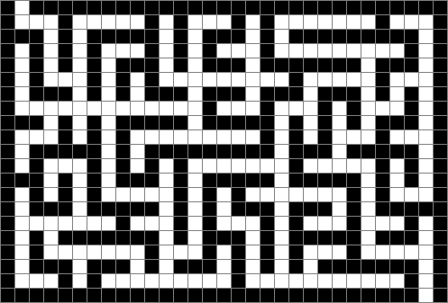

Maze
====

A small Java library for generating 2D orthogonal "perfect" mazes. 

The following maze generation algorithms are included:

* [Binary tree algorithm](src/maze/BinaryTreeMaze.java)
* [Eller's algorithm](src/maze/Ellers.java)
* [Randomized Kruskal's algorithm](src/maze/RandomizedKruskals.java)
* [Randomized Prim's algorithm](src/maze/RandomizedPrims.java)
* [Recursive backtracking](src/maze/RecursiveBacktracker.java)
* [Recursive division](src/maze/RecursiveDivider.java)
* [Sidewinder](src/maze/Sidewinder.java)
* [Wilson's algorithm](src/maze/Wilsons.java)

Also included is a [wrapper class](src/maze/TileMaze.java) that provides a tile-centric interface, in case you want to treat a maze as a grid of tiles rather than a collection of lines.

A maze generated using recursive backtracking:

A tile maze generated using Wilson's algorithm:

